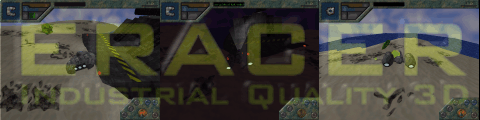



## ERacer \- Industrial Quality 3D

### Description

ERacer demonstrates industrial quality 3D graphics using Microsoft DirectX7 and Visual Basic. You can download the program and sourcecode right now and start exploring the 3D world using one of two agrav fighters, at daytime or nighttime, on one of several terrains. You can even try to defend your base against attacking alien fighters.

ERacers features include true 3D terrain, lensflares, dynamic lighting, texture animation, mipmapping, mesh animation, decals, alphatranslucency, interactive interface, sizable viewport, true 3D sound, complex physics, fighter ai and more. Enjoy!

System requirements: P166 (hot 3D accellerator) or PIII (older 3D accellerator), Windows 95/98/00/ME, Microsoft DirectX7, Joystick (optional), Soundcard (optional).

BUG FIXES (thank you for the reports, related feedback deleted): FEB16 Fixed zipfile subdirectory problem FEB17 Joystickless mode fixed FEB 25 Uploaded correct zip, joystickless mode *truely* fixed (sorry for the troubles)
 
### More Info
 

             |
---                |---
**Submitted On**   |2001-02-25 12:52:52
**By**             |[Wolfgang Kienreich](https://github.com/Planet-Source-Code/PSCIndex/blob/master/ByAuthor/wolfgang-kienreich.md)
**Level**          |Advanced
**User Rating**    |4.9 (493 globes from 101 users)
**Compatibility**  |VB 6\.0
**Category**       |[DirectX](https://github.com/Planet-Source-Code/PSCIndex/blob/master/ByCategory/directx__1-44.md)
**World**          |[Visual Basic](https://github.com/Planet-Source-Code/PSCIndex/blob/master/ByWorld/visual-basic.md)
**Archive File**   |[CODE\_UPLOAD154842252001\.zip](https://github.com/Planet-Source-Code/wolfgang-kienreich-eracer-industrial-quality-3d__1-21057/archive/master.zip)

